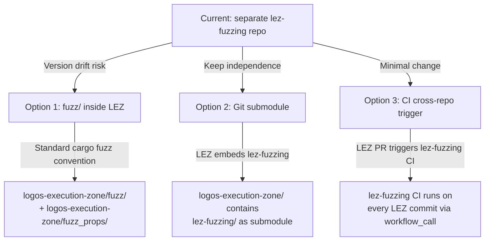

## Co-located vs. Separate Repository for LEZ Fuzzing

### The Core Problem with the Current Setup

[`docs/fuzzing.md:275`](docs/fuzzing.md:275) explicitly acknowledges the critical risk:

> "There is no submodule pin — `lez-fuzzing` reads `../logos-execution-zone` as checked out."

This means the two repositories can silently diverge. A LEZ API change will break `fuzz/Cargo.toml`'s path dependencies (`path = "../../logos-execution-zone/nssa"`) without any automated guard. A developer with a stale LEZ checkout will fuzz the wrong code version.

---

### What Co-location Would Look Like

The standard `cargo fuzz` convention places the fuzz workspace **inside** the target repo:

```
logos-execution-zone/
├── nssa/
├── common/
├── fuzz_props/          ← moved in as optional workspace member
│   └── src/
├── fuzz/                ← standard cargo fuzz location
│   ├── Cargo.toml       ← [workspace] breaks out of parent workspace
│   ├── rust-toolchain.toml   ← pins nightly for this sub-workspace only
│   └── fuzz_targets/
└── Cargo.toml           ← parent workspace (stable toolchain)
```

The `[workspace]` declaration in [`fuzz/Cargo.toml`](fuzz/Cargo.toml:11) already does exactly this break-out — the only structural change is moving the directory into LEZ.

---

### Detailed Trade-off Analysis

#### Benefits of Co-location (moving into `logos-execution-zone/`)

| Benefit | Detail |
|---|---|
| **Zero version drift** | Fuzz targets and production code are in the same commit graph — they are always in sync by construction |
| **Atomic API changes** | A PR that renames a LEZ method updates the fuzz target in the same diff; currently a LEZ PR can silently break `lez-fuzzing` |
| **Single clone onboarding** | Currently requires cloning two repos in an exact directory layout ([`docs/fuzzing.md:29-37`](docs/fuzzing.md:29)); co-location needs one |
| **Standard convention** | `cargo fuzz init` places `fuzz/` inside the target repo; this is the Rust ecosystem standard (tokio, rustls, serde all do this) |
| **Feature-gate access** | [`docs/fuzzing.md:272`](docs/fuzzing.md:272) notes that `cfg(any(test, feature = "fuzzing"))` guards on `V03State` are needed to expose internal APIs for fuzzing; these work naturally within the same workspace but require cross-repo feature flag coordination when separated |
| **LEZ CI enforces fuzz compilation** | `cargo fuzz build` runs on every LEZ PR; currently a breaking LEZ change is only discovered when someone runs `lez-fuzzing` separately |
| **Simpler path dependencies** | `path = "../../logos-execution-zone/nssa"` becomes `path = "../nssa"` — no sibling-directory assumption |

#### Costs/Risks of Co-location

| Cost | Severity | Mitigation |
|---|---|---|
| **Nightly toolchain in LEZ CI** | Medium | Place `fuzz/rust-toolchain.toml` specifying nightly — only the `fuzz/` sub-workspace uses it; stable toolchain unchanged for all production code |
| **Corpus files in LEZ history** | Low | The ~150 corpus files are small binary blobs (~30–1600 bytes each); negligible `.git` impact. Alternatively, store corpus in a separate branch or use `cargo fuzz` corpus fetch from a CI artifact cache |
| **Fuzzing noise in main repo PRs** | Low | Fuzz targets live in `fuzz/fuzz_targets/` which is outside `src/` — reviewers can ignore them |
| **Security audit scope creep** | Low | Auditors can exclude `fuzz/` and `fuzz_props/` explicitly; fuzzing code is dev-only |

#### Benefits of Staying Separate (current approach)

| Benefit | Applicability |
|---|---|
| **Independent release cadence** | Valid during initial development; becomes less important as LEZ stabilises |
| **Clean LEZ commit history** | Corpus additions and fuzzing experiments don't appear in LEZ history |
| **Separate CI billing** | Fuzzing CI minutes billed to `lez-fuzzing` repo, not LEZ repo |

#### Costs of Staying Separate

| Cost | Current evidence |
|---|---|
| **Version drift** | Explicitly flagged as a known limitation in [`docs/fuzzing.md:275`](docs/fuzzing.md:275) with no automated enforcement |
| **Two-repo onboarding friction** | Requires exact sibling directory layout; documented but error-prone |
| **Broken fuzz builds go undetected** | A LEZ refactor that breaks fuzz targets compiles fine in LEZ CI and is only caught when `lez-fuzzing` is run separately |
| **Cross-repo `cfg` feature coordination** | [`docs/fuzzing.md:272`](docs/fuzzing.md:272) requires adding `cfg(any(test, feature = "fuzzing"))` guards in LEZ — coupling that has no enforcement mechanism across repos |

---

### Architectural Options



**Option 1 — Co-location (recommended)**: Move `fuzz/` and `fuzz_props/` into `logos-execution-zone/`. Standard convention, eliminates version drift, simplest long-term maintenance. Nightly toolchain scoped to `fuzz/rust-toolchain.toml`.

**Option 2 — Git submodule**: `logos-execution-zone` embeds `lez-fuzzing` as a submodule. Preserves repo separation and independent history but adds submodule complexity (detached HEAD states, `git submodule update` friction). Not recommended — submodules are widely considered operationally painful.

**Option 3 — CI cross-repo trigger**: Keep repos separate but add a GitHub Actions `workflow_call` or `repository_dispatch` that runs `lez-fuzzing` CI on every `logos-execution-zone` push. This catches compilation breakage early without merging histories. Lower migration cost than Option 1, but does not solve the onboarding problem or the `cfg` feature-gate coordination problem.

---

### Recommendation

**Co-locate (Option 1)** for a project at this stage. The version drift problem is real and already documented; the `fuzz/Cargo.toml` sub-workspace pattern already handles nightly toolchain isolation; and the `fuzz_props` crate with its `ProtocolInvariant` framework belongs logically with the protocol it tests.

The migration is low-effort:
1. Move `fuzz/` and `fuzz_props/` into `logos-execution-zone/`.
2. Update path dependencies from `path = "../../logos-execution-zone/nssa"` to `path = "../nssa"`.
3. Add `fuzz/rust-toolchain.toml` pinning nightly.
4. Add `cargo fuzz build` smoke step to LEZ's CI workflow.
5. Archive or redirect `lez-fuzzing` with a pointer to the new location.

The only scenario where staying separate remains preferable is if the LEZ team explicitly wants fuzzing CI costs billed separately and is disciplined about running `just update-lez` and rebuilding before every fuzzing session — which the current documentation already requires but provides no enforcement for.